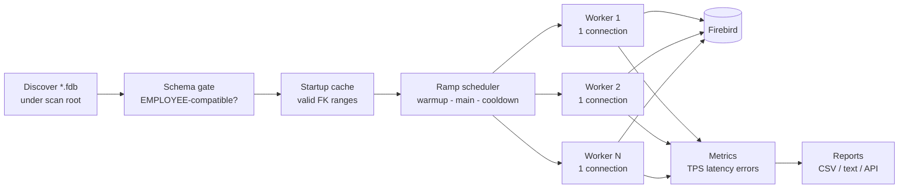
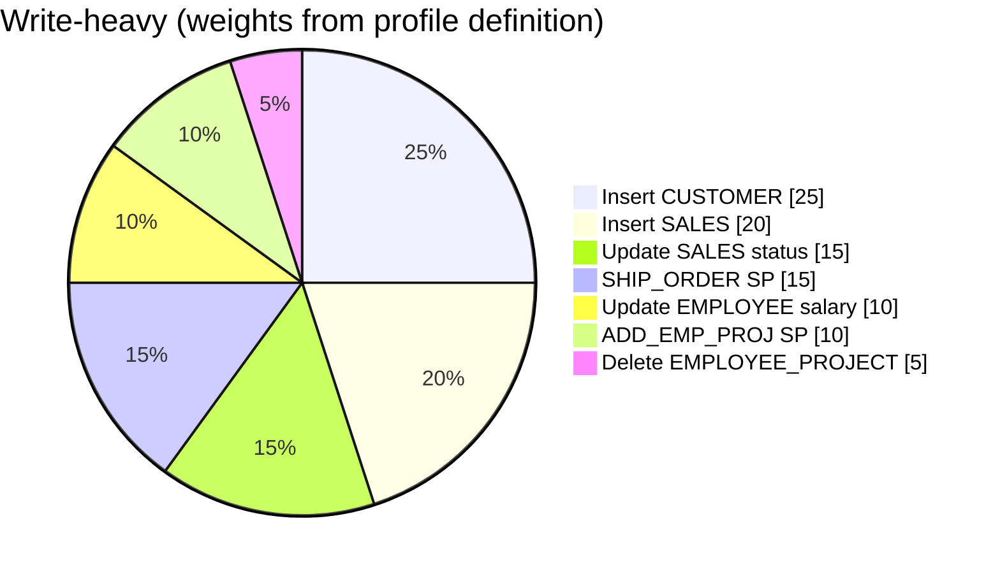
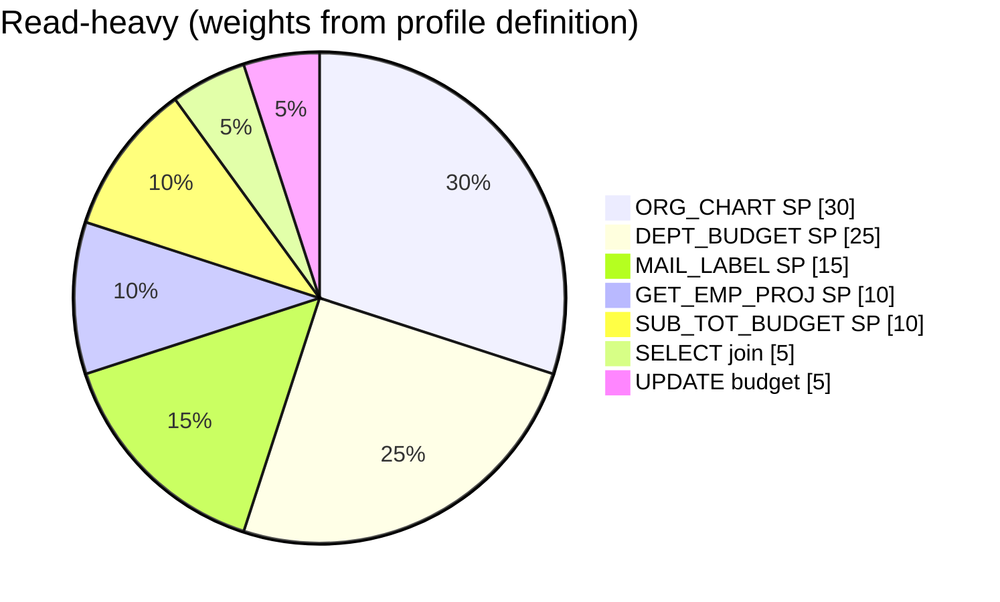
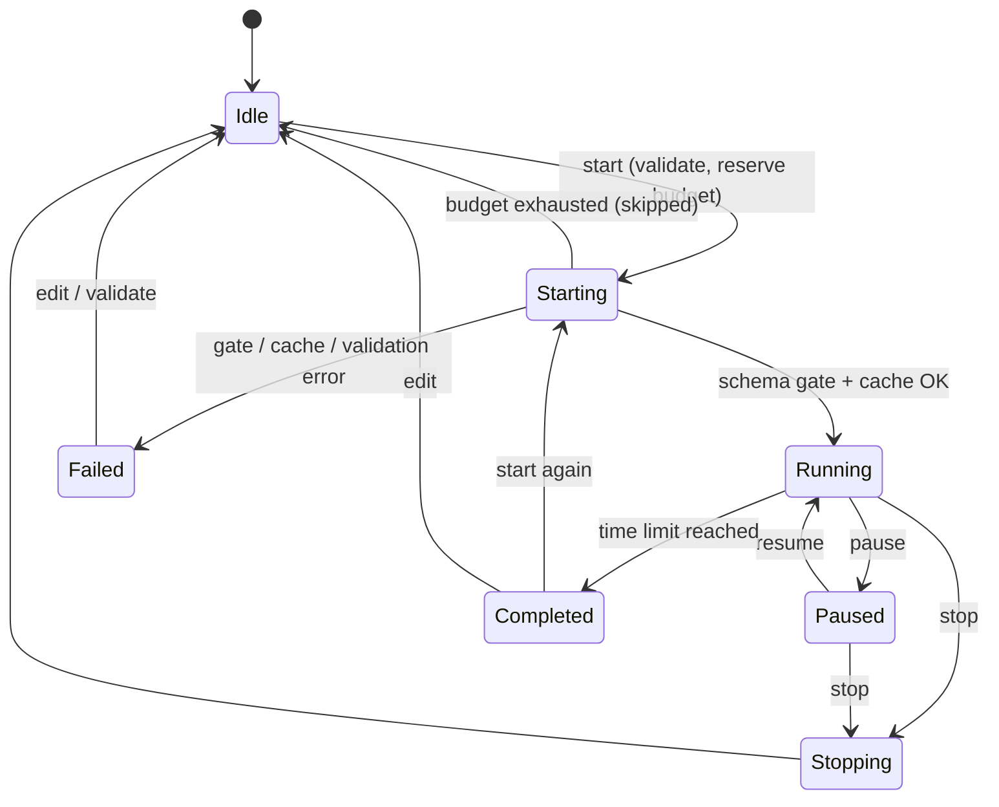
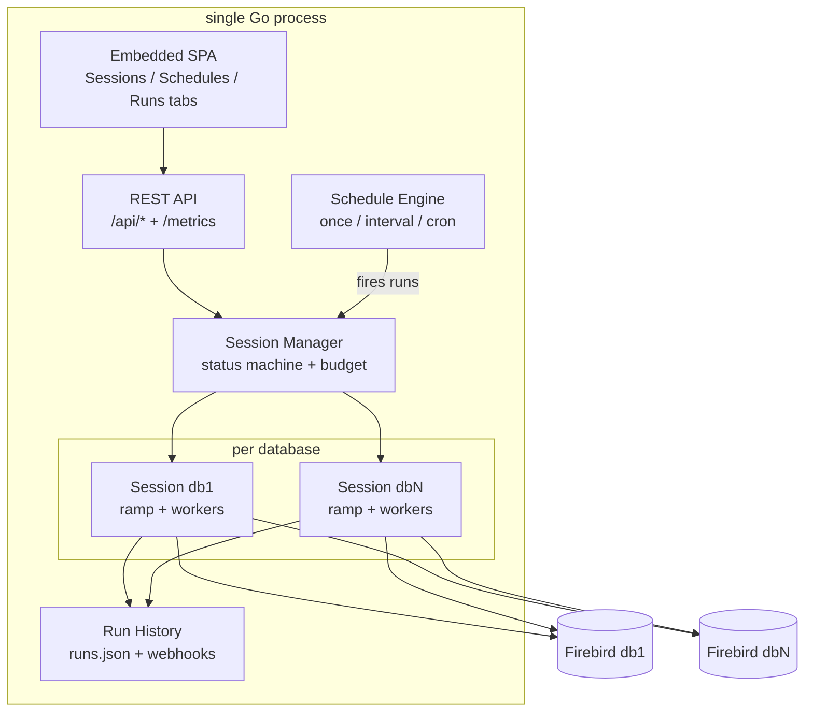
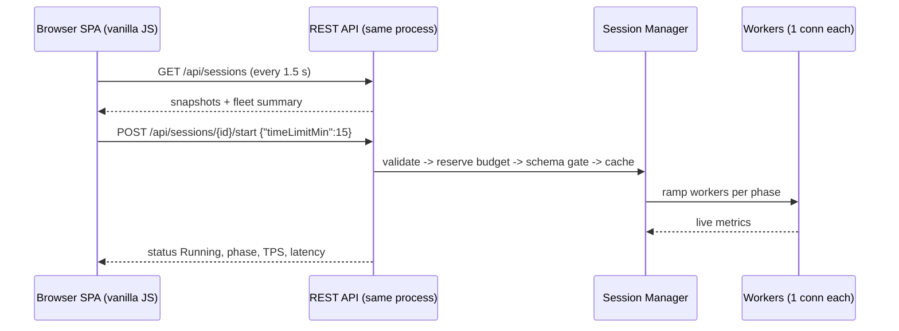
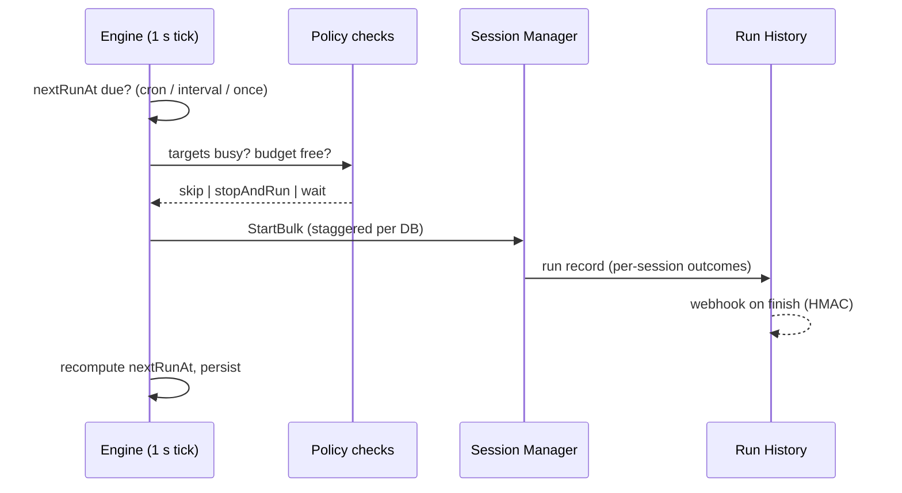
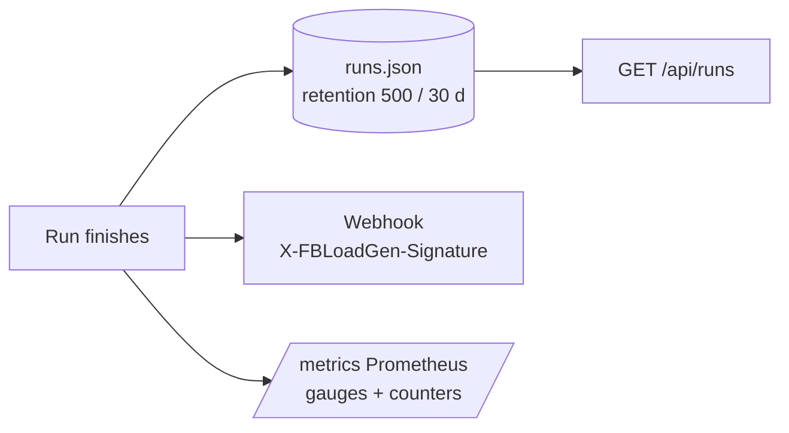
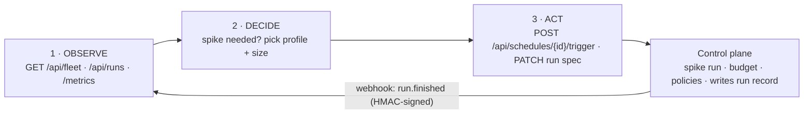

# Presentation Build Plan — IBSurgeon Firebird Load Generator

Goal: a ~16-slide (16:9) deck that explains how the Load Generator works — short text, Mermaid-based infographics — with dedicated sections on the **UI approach** and the **API-first approach** (run + schedule).
Audience: technical customers / sales engineers (Firebird DBAs, architects). Tone: product overview, minimal prose, one idea per slide. **Language: English** (a Russian variant is a separate pass, decide before translating, not after).

## 1. Format & toolchain

| Decision | Choice | Why |
|---|---|---|
| Deck format | **PPTX** (16:9, 1920×1080) | Shareable/editable outside engineering; matches IBSurgeon's customer material |
| Diagrams | **Mermaid sources (`diagrams/*.mmd`) rendered to PNG**; renderer: local HTML + mermaid.js served over `python -m http.server` and captured in a browser at 2× zoom (primary fallback since `mmdc` drags in puppeteer/Chromium — heavy and flaky on Windows) | Diagrams stay reviewable in-repo; no new heavy toolchain deps |
| Deck builder | **pptxgenjs script** (`presentation/build.mjs`) | Reproducible builds, code-reviewed slides, easy regeneration; versions pinned in `presentation/package.json` |
| Theme | IBSurgeon look: accent `#2563eb` (same blue as the product UI), dark text `#1c2733`, light bg `#f5f7fa`; Mermaid `themeVariables` mirrors those colors | Visual continuity between deck and product screenshots |
| Fonts | Segoe UI (headings semibold, body regular); Consolas for code/DSN snippets | Matches product UI, renders everywhere |
| Ramp visual | **Native PPTX line chart** (conns over time: linear up, random walk, ramp down) — Mermaid has no line/area charts and its gantt is a poor fit | The ramp is a curve, not a diagram |

Build pipeline: render diagrams (browser capture) → `node build.mjs` → `IBSurgeon_LoadGenerator.pptx`. Speaker notes: one to two sentences per slide carry the prose so slides stay ≤ 25 words.
Screenshot hygiene: product captures use a **sanitized demo rig** (`C:\Demo\FirebirdLoad\db1..N`, copies of the sample EMPLOYEE.FDB), never local dev paths.

## 2. Slide-by-slide outline

| # | Slide | Content (short text) | Visual |
|---|---|---|---|
| 1 | **Title** | IBSurgeon Firebird Load Generator — load testing for Firebird, from one CLI to a scheduled fleet | Product screenshot (UI Sessions tab) |
| 2 | **Executive summary** | Stat blocks: *1 Go binary* · *3 workload profiles* · *10+ databases in one control plane* · *REST API + schedules*; strip: **two ways to run** — one-shot CLI (`--profile/--dsn`) or control plane (`--ui`) | Stat infographic + CLI-vs-control-plane strip |
| 3 | **How it works — big picture** | "One process, one worker = one connection" — caption: the life of *one run* (gate + cache happen per start) | **Mermaid flowchart D1** below |
| 4 | **Workload model** | Profiles: write-heavy / read-heavy / spike; **real weights from the profile definitions** (D2a); schema-aware ops respect EMPLOYEE constraints; expected business exceptions (e.g. `order_already_shipped`) counted separately from real errors | **Mermaid pie D2a/b** (write-heavy + read-heavy real mixes) + op chips |
| 5 | **Connection ramp** | warmup (linear up) → main (random walk min↔max) → cooldown (linear down); spike = sawtooth cycles; time limit scales phases proportionally; no-limit mode: 60 s warmup, then steady until stopped | **Native line chart** (conns over time), spike inset |
| 6 | **Session lifecycle** | Status machine every DB goes through; pause freezes workers and the countdown | **Mermaid stateDiagram D4** |
| 7 | **Safety rails & compatibility** | Schema gate (EMPLOYEE-compatible only), startup lookup cache (valid FK ranges), fleet connection budget (maxTotalConns, even per-DB split, live resize), tx timeouts; runs on IBSurgeon's maintained Firebird Go driver (`firebirdsql-go`): Firebird wire protocol, SRP/legacy auth, wire encryption/compression | Checklist infographic |
| 8 | **Metrics & reports** | TPS, success/errors, latency p50/p95/p99, top ops; per-run report dir: live console, CSV, text sidecars, `sql_errors.log`; `GET /api/sessions/{id}/report/{file}` to download | Small report-files tree graphic |
| 9 | **Control plane architecture** | Single Go process: embedded SPA + REST API + Session Manager + Schedule Engine + Run History; workers attach to N databases; built on the IBSurgeon driver fork | **Mermaid flowchart D5** |
| 10 | **UI approach** | Thin client over the API: embedded vanilla-JS SPA — no framework, no build step, nothing to install; 1.5 s polling; tabs Sessions / Schedules / Runs; per-row controls + details drawer; light/dark themes; ships inside the exe | **Mermaid sequence D6** + UI screenshot |
| 11 | **API-first approach** | "Everything the UI can do, the API can do — the UI is just a client"; bearer token (`--ui-token`, `--ui-auth-all`), CORS, `--api-only` headless for CI; async start (`wait:false` → 202); curl/PowerShell recipes in API.md | Endpoint-map infographic (groups: **Sessions / Schedules / Runs / Discovery-config-health**) |
| 12 | **Scheduling runs** | once / interval / cron (+time zone); policies: ifRunning (skip / stopAndRun), ifBudgetFull (wait / skip), staggerSec, catchUp; persisted, survives restarts; recurring runs need a time limit | **Mermaid sequence D7** (tick → policy → staggered starts → run record) |
| 13 | **Run history & observability** | Every run recorded (scheduled or manual) with per-session outcomes and report dirs; retention 500 runs / 30 days; interrupted runs marked `cancelled` on boot; webhooks (HMAC-signed) on completion; Prometheus `/metrics`; `/api/health` | **Mermaid flowchart D8** (run record → store → webhook/metrics) |
| 14 | **AI in the loop** | The API is a machine contract — an AI agent closes the observe→decide→act loop: watch `/metrics` or the run-finished webhook, decide a spike is needed, trigger a spike-profile schedule, read the run record, adapt run-spec via PATCH and repeat; bounded by server-side policies | **Mermaid flowchart D9** (agent loop) |
| 15 | **Typical scenarios** | 3 recipe cards with 2-line curl each: *nightly soak* (cron 02:00, 30 min, webhook), *CI spike test* (`--api-only` + trigger), *fleet health check* (`/metrics` + `/api/fleet`) | Card grid, code snippets |
| 16 | **Roadmap & wrap-up** | Done: schedules, history, webhooks, metrics, auth hardening. Next: OpenAPI spec, secure credential storage, schedule chains. Footer: repo + API.md link | Roadmap arrow + summary block |

Optional backups (appendix): full CLI flag reference; full endpoint table; DSN forms (local vs remote).

## 3. Mermaid diagram inventory

Diagrams live in `presentation/diagrams/`, rendered at build time. Draft sources (to be tuned for label brevity):

**D1 — big-picture flow** (slide 3, flowchart LR):

**D2a — write-heavy mix, real weights from `profile/write_heavy.go`** (slide 4, pie):

**D2b — read-heavy mix, real weights from `profile/read_heavy.go`** (slide 4, pie):

*(D3 replaced by the native PPTX line chart on slide 6 — defaults 30 s / 120 s / 20 s.)*

**D4 — session state machine** (slide 6, stateDiagram-v2; edges match `session/manager.go` — budget failure returns to Idle, only gate/cache/validation failures produce Failed; re-running a Completed session is supported):

**D5 — control plane architecture** (slide 9, flowchart TB):

**D6 — UI request lifecycle** (slide 10, sequence; start order matches `manager.go`: budget reserve → schema gate → cache):

**D7 — schedule fire** (slide 12, sequence):

**D8 — run record flow** (slide 14, flowchart LR):

**D9 — AI agent loop** (slide 14, flowchart LR):

## 4.

- Every fact/number comes from the repo (README.md, API.md, IMPROVEMENTS.md) — no invented benchmarks. The pie chart is labeled *illustrative*.
- Product screenshots: UI Sessions/Schedules/Runs tabs (already browser-verified; capture at 1280×720, light theme) and one `--api-only` + curl terminal shot.
- Code snippets ≤ 4 lines, Consolas 14 pt, rounded gray box.

## 5. Build steps (execution order)

1. `presentation/` scaffold: `diagrams/*.mmd` (D1–D8), `theme.json` (mermaid colors), `build.mjs`, package.json (deps: pptxgenjs, @mermaid-js/mermaid-cli).
2. Render diagrams, sanity-check readability at slide scale (labels ≥ 16 pt equivalent, max ~15 nodes).
3. Implement build.mjs with slide masters: title, section, content+visual (60/40 split), full-diagram, cards.
4. Write slide content per §2, embed PNGs + screenshots.
5. Review pass: every slide has ≤ 25 words of prose; consistent accent color; all diagrams legible from 2 m.
6. Regenerate final PPTX, commit `presentation/` (sources + script; PPTX itself optionally released as artifact).

Estimated effort: diagrams ~1 h, builder ~2 h, content+screenshots ~1 h, polish ~1 h.

## 6. Acceptance criteria

- [ ] 16 slides (± appendix), summary-first, deck builds from one command
- [ ] Mermaid diagrams rendered from in-repo sources, IBSurgeon-themed
- [ ] Dedicated UI-approach (10) and API-approach (11–13) slides plus the AI-automation slide (14); every product claim traceable to README/API.md/IMPROVEMENTS.md
- [ ] Every percentage/number on a diagram cites code or docs (file:line recorded in that slide's speaker notes)
- [ ] No invented performance numbers; op-mix pies use the real profile weights
- [ ] Screenshots taken on the sanitized demo rig only; speaker notes on every slide
